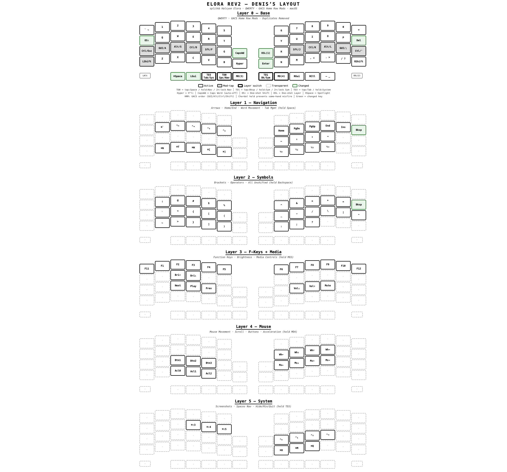

# Elora Rev2 — Custom QMK Firmware

[](https://github.com/flaticols/elora/releases/latest)

Custom QMK firmware for a [splitkb Elora Rev2](https://splitkb.com/products/elora) (Halcyon series) split keyboard with RP2040 controller. Left half has a TFT display module, right half has a Cirque trackpad. Optimized for macOS with Helix/Zed editors.

## Features

- **Home row mods** (GACS order) with chordal hold to prevent same-hand misfires
- **TFT display** (left half) — shows current layer name, Hyper status, Caps Word indicator
- **Cirque trackpad** (right half) — tap-to-click, scroll gestures, cursor glide, auto-mouse layer
- **Per-key RGB** — active keys glow in layer color (cyan/purple/red/green/yellow), all manual RGB blocked
- **Leader key** for layer locking (Leader+Space=Nav, Leader+Bksp=Symbols, Leader+Tab=System)
- **One-shot Hyper** (Cmd+Ctrl+Alt+Shift) for app shortcuts via Raycast/Kitty/Zed
- **6 layers**: Base, Navigation, Symbols, F-keys+Media, Mouse, System
- **Caps Word** support

## Layout



### Layer 0 — Base (QWERTY + Home Row Mods)

```
LEFT (outer → inner)                          RIGHT (inner → outer)
┌─────┬─────┬─────┬─────┬─────┬─────┐        ┌─────┬─────┬─────┬─────┬─────┬─────┐
│  `  │  1  │  2  │  3  │  4  │  5  │        │  6  │  7  │  8  │  9  │  0  │  =  │
├─────┼─────┼─────┼─────┼─────┼─────┤        ├─────┼─────┼─────┼─────┼─────┼─────┤
│OSft │  Q  │  W  │  E  │  R  │  T  │        │  Y  │  U  │  I  │  O  │  P  │ Del │
├─────┼─────┼─────┼─────┼─────┼─────┤        ├─────┼─────┼─────┼─────┼─────┼─────┤
│C/Esc│ G/A │ A/S │ C/D │ S/F │  G  │        │  H  │ S/J │ C/K │ A/L │ G/; │ C/' │
├─────┼─────┼─────┼─────┼─────┼─────┤        ├─────┼─────┼─────┼─────┼─────┼─────┤
│LSft │  Z  │  X  │  C  │  V  │  B  │        │  N  │  M  │  ,  │  .  │  /  │RSft │
└─────┴─────┼─────┼─────┼─────┼─────┤        ├─────┼─────┼─────┼─────┼─────┴─────┘
            │Lead │ LGui│Tb/Sy│Sp/Nv│  MO3  │  │Bs/Sm│ MO4 │ RGui│ RCtl│  -  │
            └─────┴─────┴─────┴─────┴───────┘  └─────┴─────┴─────┴─────┴─────┘
```

Home row mods (tap/hold): **G**UI, **A**lt, **C**trl, **S**hift (GACS for macOS)

Thumb keys: hold Space → Nav layer, hold Backspace → Symbols, hold Tab → System.
Layer locking: Leader + Space/Bksp/Tab toggles the layer on permanently.

### Layer 1 — Navigation (hold Space)

```
LEFT                                          RIGHT
┌─────┬─────┬─────┬─────┬─────┬─────┐        ┌─────┬─────┬─────┬─────┬─────┬─────┐
│     │     │     │     │     │     │        │     │     │     │     │     │     │
├─────┼─────┼─────┼─────┼─────┼─────┤        ├─────┼─────┼─────┼─────┼─────┼─────┤
│     │ ⌘`  │ ^←  │ ^→  │ ^↑  │ ^↓  │        │Home │PgDn │PgUp │ End │ Ins │ Del │
├─────┼─────┼─────┼─────┼─────┼─────┤        ├─────┼─────┼─────┼─────┼─────┼─────┤
│     │     │     │     │     │     │        │  ←  │  ↓  │  ↑  │  →  │     │     │
├─────┼─────┼─────┼─────┼─────┼─────┤        ├─────┼─────┼─────┼─────┼─────┼─────┤
│     │ ⌘N  │ ⌘T  │ ⌘W  │ ⌘[  │ ⌘]  │        │ ⌥←  │ ⌥↓  │ ⌥↑  │ ⌥→  │     │     │
└─────┴─────┴─────┴─────┴─────┴─────┘        └─────┴─────┴─────┴─────┴─────┴─────┘
```

Home row is transparent — compose left home row mods with right arrows (⌘→ = end of line, ⇧→ = select right).

### Layer 2 — Symbols (hold Backspace)

```
LEFT                                          RIGHT
┌─────┬─────┬─────┬─────┬─────┬─────┐        ┌─────┬─────┬─────┬─────┬─────┬─────┐
│     │     │     │     │     │     │        │     │     │     │     │     │     │
├─────┼─────┼─────┼─────┼─────┼─────┤        ├─────┼─────┼─────┼─────┼─────┼─────┤
│     │  !  │  @  │  #  │  $  │  %  │        │  ^  │  &  │  *  │  +  │  =  │ Del │
├─────┼─────┼─────┼─────┼─────┼─────┤        ├─────┼─────┼─────┼─────┼─────┼─────┤
│     │  `  │  <  │  {  │  [  │  (  │        │  _  │  -  │  /  │  \  │  |  │  "  │
├─────┼─────┼─────┼─────┼─────┼─────┤        ├─────┼─────┼─────┼─────┼─────┼─────┤
│     │  ~  │  >  │  }  │  ]  │  )  │        │  :  │  ;  │  ?  │     │     │     │
└─────┴─────┴─────┴─────┴─────┴─────┘        └─────┴─────┴─────┴─────┴─────┴─────┘
```

Left hand = brackets (open on home, close below). Right hand = operators.

### Layer 3 — F-Keys + Media (hold MO3)

```
LEFT                                          RIGHT
┌─────┬─────┬─────┬─────┬─────┬─────┐        ┌─────┬─────┬─────┬─────┬─────┬─────┐
│ F11 │ F1  │ F2  │ F3  │ F4  │ F5  │        │ F6  │ F7  │ F8  │ F9  │ F10 │ F12 │
├─────┼─────┼─────┼─────┼─────┼─────┤        ├─────┼─────┼─────┼─────┼─────┼─────┤
│     │     │ Bri↑│ Bri↓│     │     │        │     │     │     │     │     │     │
├─────┼─────┼─────┼─────┼─────┼─────┤        ├─────┼─────┼─────┼─────┼─────┼─────┤
│     │     │ ⏮  │ ⏯  │ ⏭  │     │        │     │ Vol↓│ Vol↑│ Mute│     │     │
├─────┼─────┼─────┼─────┼─────┼─────┤        ├─────┼─────┼─────┼─────┼─────┼─────┤
│     │     │     │     │     │     │        │     │     │     │     │     │     │
└─────┴─────┴─────┴─────┴─────┴─────┘        └─────┴─────┴─────┴─────┴─────┴─────┘
```

### Layer 4 — Mouse (hold MO4 / trackpad auto-activate)

```
LEFT                                          RIGHT
┌─────┬─────┬─────┬─────┬─────┬─────┐        ┌─────┬─────┬─────┬─────┬─────┬─────┐
│     │     │     │     │     │     │        │     │     │     │     │     │     │
├─────┼─────┼─────┼─────┼─────┼─────┤        ├─────┼─────┼─────┼─────┼─────┼─────┤
│     │     │     │     │     │     │        │Scr← │Scr↓ │Scr↑ │Scr→ │     │     │
├─────┼─────┼─────┼─────┼─────┼─────┤        ├─────┼─────┼─────┼─────┼─────┼─────┤
│     │     │ Mid │Right│Left │     │        │ Ms← │ Ms↓ │ Ms↑ │ Ms→ │     │     │
├─────┼─────┼─────┼─────┼─────┼─────┤        ├─────┼─────┼─────┼─────┼─────┼─────┤
│     │     │Acl2 │Acl1 │Acl0 │     │        │     │     │     │     │     │     │
└─────┴─────┴─────┴─────┴─────┴─────┘        └─────┴─────┴─────┴─────┴─────┴─────┘
```

Cirque trackpad auto-activates this layer on movement (650ms timeout). Software mouse keys kept as fallback. Acl0/1/2 = slow/medium/fast.

### Layer 5 — System (hold Tab)

```
LEFT                                          RIGHT
┌─────┬─────┬─────┬─────┬─────┬─────┐        ┌─────┬─────┬─────┬─────┬─────┬─────┐
│     │     │     │     │     │     │        │     │     │     │     │     │     │
├─────┼─────┼─────┼─────┼─────┼─────┤        ├─────┼─────┼─────┼─────┼─────┼─────┤
│     │     │     │ ⌘⇧3 │ ⌘⇧4 │ ⌘⇧5 │        │     │     │     │     │     │     │
├─────┼─────┼─────┼─────┼─────┼─────┤        ├─────┼─────┼─────┼─────┼─────┼─────┤
│     │     │     │     │     │     │        │ ^←  │ ^↓  │ ^↑  │ ^→  │     │     │
├─────┼─────┼─────┼─────┼─────┼─────┤        ├─────┼─────┼─────┼─────┼─────┼─────┤
│     │     │     │     │     │     │        │ ⌘H  │ ⌘M  │ ⌘Q  │     │     │     │
└─────┴─────┴─────┴─────┴─────┴─────┘        └─────┴─────┴─────┴─────┴─────┴─────┘
```

Screenshots (⌘⇧3=full, ⌘⇧4=area, ⌘⇧5=panel). Spaces navigation (^arrows). Hide(⌘H), Minimize(⌘M), Quit(⌘Q).

## Build

```bash
cd firmware && ./build.sh
# Output:
#   firmware/output/elora_left_display.uf2    (left half — TFT display)
#   firmware/output/elora_right_trackpad.uf2   (right half — Cirque trackpad)
```

See [firmware/BUILD.md](firmware/BUILD.md) for local QMK build instructions.

## Flash

Each half gets its own firmware — do NOT flash the same .uf2 to both sides.

1. **Left half**: double-tap reset, drag `elora_left_display.uf2` onto `RPI-RP2`
2. **Right half**: double-tap reset, drag `elora_right_trackpad.uf2` onto `RPI-RP2`
3. Connect USB to the **left** half (master)

## Releases

Pushes to `latest` that modify `firmware/**` automatically build both halves and create a GitHub release with `.uf2` artifacts attached. Version is bumped based on commit message keywords (`feat` = minor, `breaking` = major, otherwise patch).

## Links

- [REQUIREMENTS.md](REQUIREMENTS.md) — full design spec
- [firmware/BUILD.md](firmware/BUILD.md) — detailed build instructions
- [elora-cheatsheet.md](elora-cheatsheet.md) — printable layout reference
